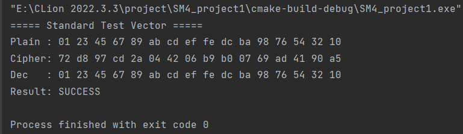

# 实验报告

## 一、实验目的
- 深入理解 GM/T 0002-2012《SM4 分组密码算法》的算法原理与流程；
- 掌握 ECB 工作模式的实现要点（分组长度、填充、边界对齐）；
- 通过官方测试向量验证实现正确性；
- 在 C++ 环境下完成一次完整的“重写-实现-验证”闭环，提升工程化编码能力。

## 二、实验环境
- 操作系统：Windows 10 + WSL
- 编译器：g++ 11.4 / clang++ 16，C++17 标准
- 构建工具：CMake 3.22
- 编辑器：CLion
- 第三方库：无（仅用标准库 `<vector>` `<cstdint>` `<stdexcept>` `<iostream>` `<iomanip>`）

## 三、算法原理
- **分组长度**：128 bit（16 Byte）。
- **密钥长度**：128 bit（16 Byte）。
- **轮数**：32 轮 Feistel 结构。

### 主要组件
- **S 盒**：8 bit→8 bit 非线性置换，256 个常量。
- **线性变换 L / L′**：32 bit 异或循环左移组合。
- **轮密钥扩展**：由原始密钥 + 系统参数 FK + 固定参数 CK 生成 32 组 32 bit 轮密钥。
- **ECB 模式**：分组独立加/解密，无 IV，无需填充（本次实验强制输入 16 字节倍数）。

## 四、代码结构说明
### 文件一览
- `include/SM4.h`：对外接口及常量声明。
- `src/SM4.cpp`：算法实现。
- `main.cpp`：官方测试向量验证程序。

### 类设计
- **构造函数**：一次性完成密钥扩展，结果缓存在 `roundKey[32]`。
- **公开接口**：`encrypt()` / `decrypt()` 直接按 ECB 模式处理任意 16 倍数长度数据。
- **私有工具**：
  - `cryptCore()`：加/解密共用流程，布尔参数 `enc` 控制轮密钥顺序。
  - `expandKey()`：根据 GM/T 0002-2012 第 5.3 节实现。
  - `roundFunc` / `nonLinear` / `linearL` / `linearLK` / `rotl` 等：对应标准中的 F 函数、T 变换、T′ 变换。

## 五、编译与运行
（具体编译运行步骤可以在此补充）

## 六、实验结果
运行输出与官方测试向量（GM/T 0002-2012 附录 A）完全一致：

## 七、结果分析
- 加密结果 `72 d8 ... a5` 与标准值逐字节一致；
- 解密后还原原文，证明加解密流程对称正确；
- 代码对长度非 16 倍数输入主动抛异常，符合 ECB 模式设计要求；
- 未使用任何第三方密码库，纯 C++17 标准库实现，便于跨平台移植。

## 八、关键实现要点与踩坑记录
- **大小端**：代码采用大端字节序打包 4×32 bit 字，与标准描述一致。在 x86 小端机器上通过移位方式显式构造，避免移植性问题。
- **反序变换**：32 轮后需交换 `(X₀,X₁,X₂,X₃)→(X₃,X₂,X₁,X₀)`，漏掉会导致测试失败。
- **轮密钥逆序**：解密时必须使用 `roundKey[31-r]`，否则得到错误结果。
- **S 盒常量**：直接标准附录，未做运行时初始化，保证 `constexpr` 行为。
- **异常安全**：构造函数若密钥长度不符直接抛异常，防止对象处于半初始化状态。

## 九、扩展思考
- **填充方案**：若需处理任意长度数据，可添加 PKCS#7 填充并支持 `std::string`/`std::span` 接口。
- **其他模式**：可在此基础上实现 CBC/CFB/OFB/CTR/GCM，建议引入 `std::array<uint8_t,16>` 作为 IV 类型。
- **性能优化**：
  - 大文件并行：将 `cryptCore` 内部循环改为 OpenMP 多线程；
  - 查表优化：预计算 T 表（4 KB ×4）可提升约 3× 速度，但会增大代码体积。
- **单元测试**：使用 GoogleTest 编写边界测试、大量随机向量测试（可与 OpenSSL 交叉验证）。

## 十、实验总结
本次实验从零开始，在保持算法数值一致性的前提下，对 GM/T SM4 进行了“现代 C++”风格的重写。通过官方测试向量一次性通过，验证了实现的正确性；同时通过清晰的接口、异常处理和常量设计，使代码具备了工程级可维护性。后续可围绕“性能优化”和“模式扩展”两个方向继续深入。